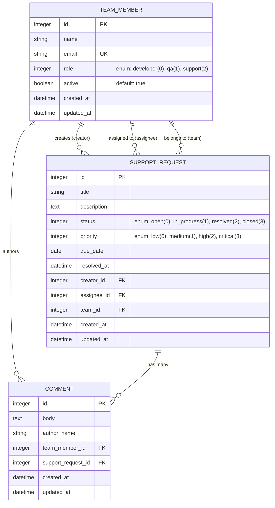

# SupportFlow — Internal Support Request Management System

**SupportFlow** is an internal web application designed to centralize, prioritize, assign, and track technical support requests within an organization. It replaces scattered communication channels with an intuitive Rails JSON API and a responsive Vue 3 frontend, ensuring full visibility into team workload, ticket status, and overdue requests.

---

## 🚀 Tech Stack & Prerequisites

### Backend
- **Ruby**: 3.x (Compatible with Ruby 3.0+)
- **Ruby on Rails**: 8.1 / 7.x (API Mode)
- **Database**: SQLite3 (Development & Test), PostgreSQL ready (Production)
- **Testing**: RSpec 7.x, FactoryBot, Shoulda Matchers, Faker

### Frontend
- **Framework**: Vue 3 (Composition API `<script setup>`)
- **Build Tool**: Vite 8.x
- **State Management**: Pinia 3.x
- **Router**: Vue Router 4.x
- **HTTP Client**: Axios 1.x

---

## 📁 Repository Structure

```
support-flow/
├── backend/                  # Rails 8.1 API Application
│   ├── app/
│   │   ├── controllers/      # Api::V1 Controllers
│   │   └── models/           # TeamMember, SupportRequest, Comment
│   ├── config/               # Routes, Database & CORS Configuration
│   ├── db/                   # Migrations & Seeds
│   ├── spec/                 # RSpec Test Suite (Models, Requests, Controllers)
│   ├── Gemfile
│   └── .env.example
├── frontend/                 # Vue 3 + Vite Application
│   ├── src/
│   │   ├── api/              # Axios HTTP Client
│   │   ├── components/       # StatusBadge, PriorityBadge, SupportRequestForm, Layout
│   │   ├── router/           # Vue Router Navigation Rules
│   │   ├── stores/           # Pinia Stores (supportRequest, teamMember, dashboard)
│   │   └── views/            # Dashboard, RequestList, RequestDetail, TeamMembers
│   ├── package.json
│   └── .env.example
├── docs/                     # API & Architecture Specifications
└── README.md                 # Project Overview & Setup Instructions
```

---

## ⏱️ Quick Setup Guide (< 5 Minutes)

Follow these simple steps to clone, configure, seed, and run SupportFlow on your local machine.

### Prerequisites Verification
Ensure you have **Ruby 3+**, **Bundler**, **Node.js (18+)**, and **npm** installed.
```bash
ruby -v
node -v
```

---

### Step 1: Clone the Repository
```bash
git clone https://github.com/Jichuta/support-flow.git
cd support-flow
```

---

### Step 2: Backend Setup (Rails API)
1. Navigate to the `backend/` directory:
   ```bash
   cd backend
   ```
2. Copy the environment configuration:
   ```bash
   cp .env.example .env
   ```
3. Install Ruby gems:
   ```bash
   bundle install
   ```
4. Setup database schema and populate seed data:
   ```bash
   bundle exec rails db:migrate
   bundle exec rails db:seed
   ```
   *Seed output creates 6 team members, 15 support requests (with open, in_progress, resolved, closed, and overdue items), and 12 comments.*

5. Start the Rails API server on port 3000:
   ```bash
   bundle exec rails server -p 3000
   ```
   *The Rails API will be accessible at `http://localhost:3000`.*

---

### Step 3: Frontend Setup (Vue 3 + Vite)
1. Open a new terminal window and navigate to `frontend/`:
   ```bash
   cd frontend
   ```
2. Copy the environment configuration:
   ```bash
   cp .env.example .env
   ```
3. Install Node packages:
   ```bash
   npm install
   ```
4. Start the Vite development server:
   ```bash
   npm run dev
   ```
5. Open your browser and navigate to:
   ```
   http://localhost:5173
   ```

---

## 🧪 Automated Testing

SupportFlow includes a comprehensive RSpec test suite covering ActiveRecord models, business rules, API controllers, request specs, and error handling.

To run the entire test suite:
```bash
cd backend
bundle exec rspec
```

### Expected Output
```
Finished in 2.02 seconds (files took 10.41 seconds to load)
70 examples, 0 failures
```

---

## 🔌 API Endpoint Documentation (`/api/v1`)

All API endpoints are namespaced under `/api/v1` and accept/return JSON payloads.

| Method | Endpoint | Description | Query Parameters |
| :--- | :--- | :--- | :--- |
| `GET` | `/api/v1/team_members` | List all team members sorted by name | — |
| `POST` | `/api/v1/team_members` | Create a new team member | — |
| `PATCH` | `/api/v1/team_members/:id` | Update or activate/deactivate member | — |
| `GET` | `/api/v1/support_requests` | List requests with filters | `status`, `priority`, `team_member_id`, `overdue`, `unassigned`, `q` |
| `GET` | `/api/v1/support_requests/:id` | Return request details & comments | — |
| `POST` | `/api/v1/support_requests` | Create a new support request | — |
| `PATCH` | `/api/v1/support_requests/:id` | Update assignment, status, priority, due date | — |
| `POST` | `/api/v1/support_requests/:id/comments` | Add a comment to a request | — |
| `GET` | `/api/v1/dashboard` | Return summary metrics & grouped statistics | — |

---

### API Payload Examples

#### 1. `GET /api/v1/dashboard`
```json
{
  "total_requests": 15,
  "overdue_requests": 4,
  "unassigned_requests": 2,
  "requests_by_status": {
    "open": 5,
    "in_progress": 4,
    "resolved": 3,
    "closed": 3
  },
  "requests_by_priority": {
    "low": 3,
    "medium": 6,
    "high": 4,
    "critical": 2
  }
}
```

#### 2. `POST /api/v1/support_requests`
**Request Payload:**
```json
{
  "support_request": {
    "title": "Database connection pool timeout",
    "description": "High latency observed on background jobs due to pool limits.",
    "priority": "high",
    "due_date": "2026-07-30",
    "creator_id": 1,
    "team_id": 1
  }
}
```
**Response (201 Created):**
```json
{
  "id": 16,
  "title": "Database connection pool timeout",
  "description": "High latency observed on background jobs due to pool limits.",
  "status": "open",
  "priority": "high",
  "due_date": "2026-07-30",
  "resolved_at": null,
  "overdue": false,
  "creator": { "id": 1, "name": "QA Test", "email": "qa@test.com", "role": "qa", "active": true },
  "assignee": null,
  "team": { "id": 1, "name": "QA Test", "email": "qa@test.com", "role": "qa", "active": true },
  "created_at": "2026-07-23T19:10:00.000Z",
  "updated_at": "2026-07-23T19:10:00.000Z"
}
```

#### 3. Error Response Standard (422 Unprocessable Entity)
```json
{
  "error": "Validation failed",
  "details": [
    "Body is too short (minimum is 10 characters)"
  ]
}
```

---

## 📐 Architecture & Entity-Relationship Diagram



---

## 👥 Team Organization & Contribution Table

| Engineer | Primary Area Ownership | Backend Contributions | Frontend & Test Contributions |
| :--- | :--- | :--- | :--- |
| **Engineer 1** | Models, Migrations & Team Members API | `TeamMember` model, migrations, validations, enums & `Api::V1::TeamMembersController` | RSpec unit specs for `TeamMember`, `TeamMembersController`, and `TeamMembers.vue` view |
| **Engineer 2** | Support Requests API & Business Rules | `SupportRequest` & `Comment` models, business rules (inactive assignee, `resolved_at`, closed state restrictions), `Api::V1::SupportRequestsController` & `Api::V1::CommentsController` | Request Specs for API endpoints, `RequestList.vue` with debounced search/filters, `RequestDetail.vue` |
| **Engineer 3** | Dashboard API & Vue Architecture | `Api::V1::DashboardController` metrics aggregation & `ApplicationController` error handling rescue handlers | Pinia stores, `Dashboard.vue`, `SupportRequestForm.vue` (create/edit views), and layout components |

---

## 📌 Known Limitations & Future Enhancements

### Known Limitations
- Real-time updates (WebSockets / ActionCable) are not included in Phase 1/2 scope.
- Authentication and RBAC (Role-Based Access Control) authorization are intentionally simplified as per challenge guidelines.

### Future Enhancements
- Integration of ActionCable for live ticket status notifications.
- Advanced pagination and sorting options for large request volumes.
- Public deployment configuration using Docker and Render/Fly.io.