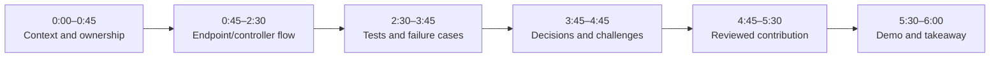
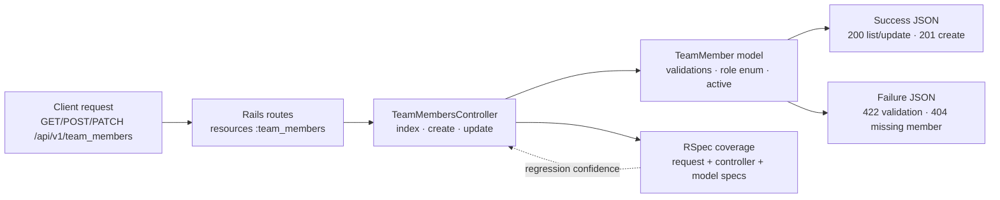
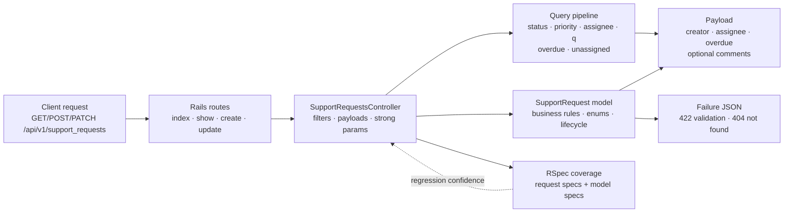
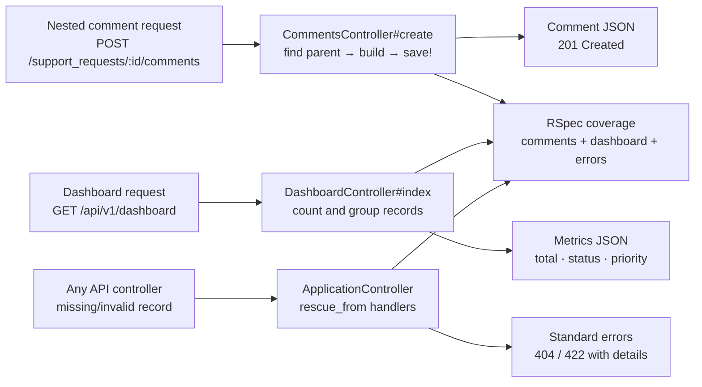

# SupportFlow Individual Defense Guide

This guide prepares each engineer for the required 5–7 minute individual
defense. It connects the owned endpoint or controller to its route, model
behavior, tests, technical decisions, challenges, and reviewed contributions.

## Recommended 6-Minute Structure

Each engineer should show one successful request and one failure case when
possible. The defense should explain why the implementation works, not only
which files were changed.

## Carlos — Team Members API

### Individual controller flow

### Endpoint and test talking points

- `GET /api/v1/team_members` returns members ordered by name.
- `POST /api/v1/team_members` permits name, email, role, and active state and
  returns `201 Created` for valid data.
- `PATCH /api/v1/team_members/:id` updates an existing member and returns `404`
  when the record does not exist.
- The model protects the endpoint with required fields, case-insensitive email
  uniqueness, email format validation, role values, and the active default.
- Tests cover ordering, valid/invalid create, valid/invalid update, missing
  records, model associations, enum values, and validation behavior.

Relevant implementation:

- [`team_members_controller.rb`](../backend/app/controllers/api/v1/team_members_controller.rb)
- [`team_members_spec.rb`](../backend/spec/requests/api/v1/team_members_spec.rb)
- [`team_members_controller_spec.rb`](../backend/spec/controllers/api/v1/team_members_controller_spec.rb)
- [`team_member_spec.rb`](../backend/spec/models/team_member_spec.rb)

### Decisions and challenges to explain

- Why controller-level strong parameters prevent unrelated request fields from
  reaching the model.
- Why model validations remain the source of truth instead of duplicating all
  validation rules in the controller.
- Why the API returns a consistent validation payload with `422 Unprocessable
  Entity`.
- How the TeamMember model supports the rest of the application through
  creator, assignee, and comment associations.

### Reviewed contribution evidence

- [PR #13 — Team Members API controller](https://github.com/Jichuta/support-flow/pull/13)
  was authored and merged by Carlos and approved by Alejandro.
- [PR #24 — Support Request List view](https://github.com/Jichuta/support-flow/pull/24)
  shows Carlos’s additional integration contribution; it was approved by
  Alejandro and Josoe.

## Alejandro — Support Requests API and Business Rules

### Individual controller flow

### Endpoint and test talking points

- `GET /api/v1/support_requests` applies only recognized enum filters and
  supports search, overdue, unassigned, priority, status, and assignee
  filtering.
- The list is ordered newest first and eager-loads creator and assignee data.
- `GET /api/v1/support_requests/:id` returns the request detail plus ordered
  comments and author data.
- `POST` and `PATCH` use strong parameters and serialize the same public
  payload shape after successful persistence.
- The model enforces the request lifecycle: inactive assignees are rejected,
  resolving requires a comment, `resolved_at` is maintained, closed requests
  cannot be edited or reopened, and overdue status is calculated from due date
  and lifecycle state.
- Tests cover filter combinations, search behavior, successful and invalid
  create/update, missing records, lifecycle rules, assignee constraints, and
  overdue behavior.

Relevant implementation:

- [`support_requests_controller.rb`](../backend/app/controllers/api/v1/support_requests_controller.rb)
- [`support_requests_spec.rb`](../backend/spec/requests/api/v1/support_requests_spec.rb)
- [`support_request_spec.rb`](../backend/spec/models/support_request_spec.rb)
- [`support_request.rb`](../backend/app/models/support_request.rb)

### Decisions and challenges to explain

- Why filters are applied through a controlled query pipeline instead of
  interpolating arbitrary SQL.
- Why `sanitize_sql_like` is used for the title search.
- Why the response payload is assembled explicitly rather than returning raw
  Active Record objects, especially when nested comments are included.
- Why domain rules belong in the model and are exercised independently from
  request behavior.
- How the later `team_id` removal and form refactor aligned the frontend with
  the actual backend domain.

### Reviewed contribution evidence

- [PR #15 — SupportRequests endpoint with filters](https://github.com/Jichuta/support-flow/pull/15)
  was authored and merged by Alejandro and approved by Josoe.
- [PR #27 — SupportRequest form](https://github.com/Jichuta/support-flow/pull/27)
  was authored and merged by Alejandro and approved by Carlos and Josoe.
- [PR #19 — Phase 2 API validation](https://github.com/Jichuta/support-flow/pull/19)
  was authored and merged by Alejandro and approved by Josoe.

## Josoe — Comments, Dashboard, and Shared API Error Handling

### Individual controller flow

### Endpoint and test talking points

- `POST /api/v1/support_requests/:support_request_id/comments` finds the
  parent request, builds the nested comment, persists it, and returns `201`.
- Comment validation failures become `422` responses and a missing support
  request becomes `404` through the shared error handling path.
- `GET /api/v1/dashboard` calculates total requests and grouped counts by
  status and priority.
- Enum keys are converted into readable JSON keys so the frontend does not
  need to understand database integer values.
- `ApplicationController` centralizes `RecordNotFound`, `RecordInvalid`, and
  custom error responses for the API.
- Tests cover valid and invalid comments, missing parents, dashboard counts,
  not-found errors, validation errors, and custom errors.

Relevant implementation:

- [`comments_controller.rb`](../backend/app/controllers/api/v1/comments_controller.rb)
- [`dashboard_controller.rb`](../backend/app/controllers/api/v1/dashboard_controller.rb)
- [`application_controller.rb`](../backend/app/controllers/application_controller.rb)
- [`comments_spec.rb`](../backend/spec/requests/api/v1/comments_spec.rb)
- [`dashboard_spec.rb`](../backend/spec/requests/api/v1/dashboard_spec.rb)
- [`error_handling_spec.rb`](../backend/spec/requests/error_handling_spec.rb)

### Decisions and challenges to explain

- Why comments are nested under support requests in the route and controller.
- Why dashboard metrics use database grouping rather than loading every record
  into Ruby.
- Why shared error handling belongs in `ApplicationController` instead of
  repeating rescue logic in every endpoint.
- How the API error contract lets Vue display consistent failure states.
- How the comments and dashboard endpoints support the detail and dashboard
  views without coupling controllers to frontend components.

### Reviewed contribution evidence

- [PR #12 — Consistent API error handling](https://github.com/Jichuta/support-flow/pull/12)
  was authored and merged by Josoe and approved by Carlos and Alejandro.
- [PR #16 — Nested Comments endpoint](https://github.com/Jichuta/support-flow/pull/16)
  was authored and merged by Josoe and approved by Carlos.
- [PR #17 — Dashboard endpoint](https://github.com/Jichuta/support-flow/pull/17)
  was authored and merged by Josoe and approved by Alejandro and Carlos.
- [PR #26 — Team Members frontend view](https://github.com/Jichuta/support-flow/pull/26)
  was approved by Alejandro, demonstrating cross-area review beyond API work.

## Cross-Engineer Questions to Rehearse

| Question | Evidence to show |
|---|---|
| How does a request travel through the system? | `routes.rb` → controller → model/query → JSON response |
| Where are invalid states prevented? | Model validations/business rules plus `422` request specs |
| How did you verify your endpoint? | The corresponding request spec and one failure scenario |
| What did another engineer review? | The linked PR approval and the reviewer's requested context |
| What changed after integration? | Shared UI, linting, Vuetify, and `team_id` alignment PRs |
| What would you improve next? | Authentication, authorization, pagination, and final validation are future scope |

## Closing Answer Pattern

End with this concise structure:

> I owned **[controller/endpoint]**. The important decision was **[decision]**
> because **[reason]**. I verified it with **[tests]**, including **[failure
> case]**. The main challenge was **[challenge]**, and integration with
> **[teammate/contribution]** was validated through **[PR/review]**.

