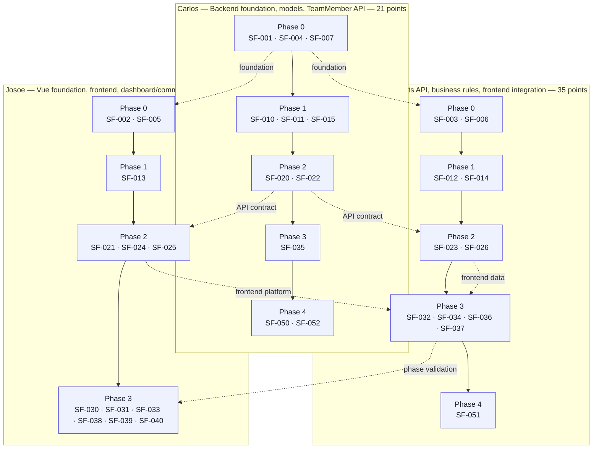
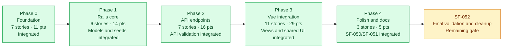
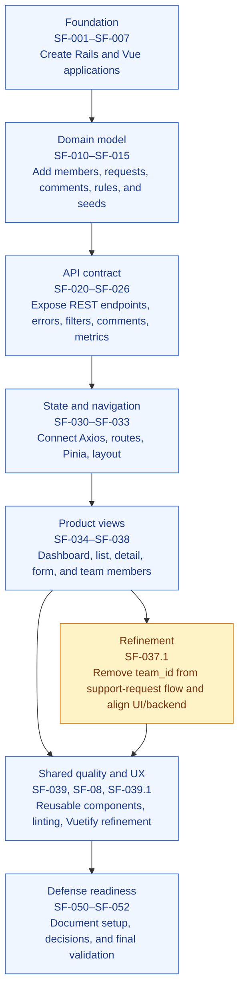

# SupportFlow Team Workflow and Story Evolution

This page summarizes how the team divided the work, integrated changes, and
evolved the user stories from foundation work into the final product. The
diagrams are intended for the project defense and use the ticket distribution,
dependency graph, sprint plan, Git history, and merged pull requests as their
source material.

## 1. Individual Work by Assignee

The work was divided by technical ownership while remaining connected through
shared phase validation and API/frontend dependencies. Story points show the
planned distribution from the user-story inventory.

### What this shows

- Carlos owned the Rails foundation, relational models, TeamMember API, and
  final project validation.
- Alejandro owned the SupportRequest domain, business rules, API endpoint,
  Pinia state, dashboard/detail/form integration, and technical decisions.
- Josoe owned the Vue foundation, routing/layout, shared UI, Team Members view,
  and dashboard/comments API work.
- The dependency arrows explain why ownership was distributed but delivery was
  integrated rather than isolated.

## 2. How the Stories Were Integrated

The team used feature branches and pull requests into `main`. Validation and
contract work acted as integration gates between backend and frontend phases.

```mermaid
flowchart LR
    subgraph Foundation["Phase 0 — Foundation"]
        F1["SF-001 Rails API\nPR #2"]
        F2["SF-002 Vue/Vite\nPR #1"]
        F3["SF-003 CORS\nPR #6"]
        F4["SF-004 RSpec\nPR #5"]
        F5["SF-005 Proxy\nPR #3"]
        F6["SF-006 Frontend deps\nPR #4"]
        F1 --> F3
        F2 --> F5 --> F6
        F4 --> G0
        F3 --> G0
        F6 --> G0
    end

    G0{{"Phase 0 integrated\nAPI + Vue + test foundation"}}

    subgraph Core["Phase 1 — Rails core"]
        M1["SF-011 TeamMember\nPR #7"]
        M2["SF-012 SupportRequest\nPR #8"]
        M3["SF-013 Comment\nPR #9"]
        M4["SF-014 Seeds\nPR #10"]
        M1 --> M2 --> M3 --> M4
    end

    G0 --> M1
    M4 --> G1{{"Phase 1 model\nand seed baseline"}}

    subgraph API["Phase 2 — API endpoints"]
        AP0["SF-020 Routes\nPR #11 closed"]
        AP1["SF-021 Error handling\nPR #12"]
        AP2["SF-022 TeamMembers API\nPR #13"]
        AP3["SF-023 SupportRequests API\nPR #15"]
        AP4["SF-024 Comments API\nPR #16"]
        AP5["SF-025 Dashboard API\nPR #17"]
        AP6["SF-026 Validation\nPR #19"]
        AP0 --> AP1
        AP1 --> AP2
        AP1 --> AP3 --> AP4
        AP3 --> AP5
        AP2 --> AP6
        AP4 --> AP6
        AP5 --> AP6
    end

    G1 --> AP0
    AP6 --> G2{{"Phase 2 integrated\nREST API + validation"}}

    subgraph UI["Phase 3 — Vue integration"]
        UI0["SF-030 Axios client\nPR #18"]
        UI1["SF-031 Router\nPR #20"]
        UI2["SF-032 Pinia stores\nPR #21"]
        UI3["SF-033 Layout\nPR #22"]
        UI4["SF-034 Dashboard\nPR #23"]
        UI5["SF-035 Request list\nPR #24"]
        UI6["SF-036 Detail/comments\nPR #25"]
        UI7["SF-037 Create/edit form\nPR #27"]
        UI8["SF-038 Team Members\nPR #26"]
        UI9["SF-039 Shared UI\nPR #28"]
        UI0 --> UI1 --> UI2 --> UI3
        UI2 --> UI4
        UI3 --> UI5 --> UI6 --> UI7
        UI3 --> UI8
        UI3 --> UI9
    end

    G2 --> UI0
    UI9 --> G3{{"Phase 3 integrated\nworking Vue product"}}

    subgraph Polish["Phase 4 — Polish and documentation"]
        P1["SF-050 Project docs\nPR #32"]
        P2["SF-051 Technical decisions\nPR #33"]
        P3["SF-052 Final validation\npending"]
        P1 --> P3
        P2 --> P3
    end

    G3 --> P1
    G3 --> P2
```

## 3. Delivery Progress by Phase

The planned inventory contains 34 stories and 79 story points. The progress
view separates integrated evidence from remaining final validation, instead of
assuming that every planning-table status was updated automatically.

### Evidence of progress

| Milestone | Evidence in GitHub history | Result |
|---|---|---|
| Foundation | PRs #1–#6 | Rails, Vue, CORS, proxy, dependencies, and RSpec landed |
| Domain model | PRs #7–#10 | Team members, support requests, comments, and seeds landed |
| API layer | PRs #12–#19 | Error handling, endpoints, and Phase 2 validation landed |
| Frontend product | PRs #20–#31 | Client, router, stores, views, shared UI, linting, and Vuetify refinements landed |
| Documentation | PRs #32–#33 | Project documentation and technical decisions landed |
| Final gate | SF-052 | Final validation and cleanup remain to be completed |

## 4. How the User Stories Evolved

The stories evolved from infrastructure tickets into vertical product slices.
Later changes refined the original implementation based on integration needs
and UI feedback.

### Defense narrative

1. The team first created a runnable full-stack foundation and agreed on the
   API boundary.
2. The Rails domain and endpoints were built before the frontend consumed them,
   reducing integration ambiguity.
3. Pinia, routing, and layout then connected the API to user-facing views.
4. The product was refined after integration: shared components, linting,
   Vuetify, and the removal of obsolete `team_id` handling improved alignment
   between the UI and backend.
5. Documentation and ADRs captured the final choices before the remaining
   validation gate.

## Sources and Interpretation

- Planned ownership, points, dependencies, and sprint sequence: the
  `USER_STORIES.md` ticket distribution and dependency sections.
- Integrated work and timing: merged pull requests and commit history in the
  `Jichuta/support-flow` GitHub repository.
- A PR number is shown where GitHub provides direct integration evidence. A
  closed SF-020 route PR is labeled explicitly rather than being presented as
  a merged PR.
- "Integrated" means there is merged Git evidence for the phase or feature;
  it does not replace the team's formal ticket-status process.

